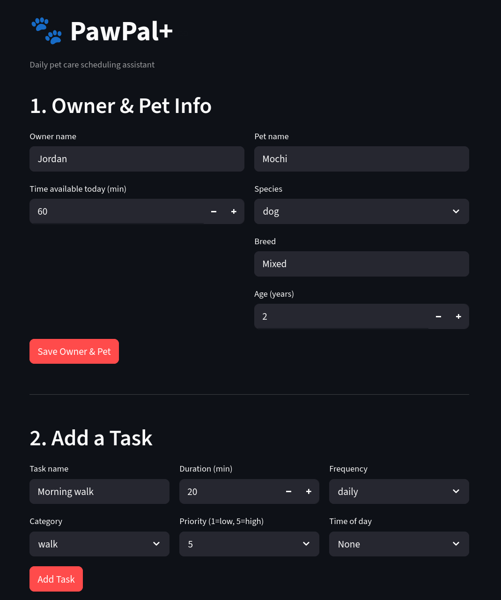

# PawPal+ (Module 2 Project)

You are building **PawPal+**, a Streamlit app that helps a pet owner plan care tasks for their pet.

## Scenario

A busy pet owner needs help staying consistent with pet care. They want an assistant that can:

- Track pet care tasks (walks, feeding, meds, enrichment, grooming, etc.)
- Consider constraints (time available, priority, owner preferences)
- Produce a daily plan and explain why it chose that plan
888stem first (UML), then implement the logic in Python, then connect it to the Streamlit UI.

## What you will build

Your final app should:

- Let a user enter basic owner + pet info
- Let a user add/edit tasks (duration + priority at minimum)
- Generate a daily schedule/plan based on constraints and priorities
- Display the plan clearly (and ideally explain the reasoning)
- Include tests for the most important scheduling behaviors

## Getting started

### Setup

```bash
python -m venv .venv
source .venv/bin/activate  # Windows: .venv\Scripts\activate
pip install -r requirements.txt
```

## Features

### Greedy Priority Scheduler
Tasks are ranked by priority (1–5) and scheduled in order until the owner's available time is exhausted. Higher-priority tasks always claim time before lower-priority ones. Tasks that don't fit are collected in a `skipped` list with an explanation. The algorithm is intentionally simple — transparent and predictable for everyday pet care, where priority order reliably reflects owner intent.

### Time-of-Day Ordering
Each task has an optional `time_of_day` field (`morning`, `afternoon`, `evening`). After the greedy pass selects which tasks to schedule, the final plan is sorted chronologically using a stable sort — so tasks within the same period preserve their original insertion order. Tasks with no time preference are placed last.

### Recurring Task Logic
Tasks declare a `frequency`: `daily`, `weekly`, or `as_needed`. Before scheduling, each task is passed through `is_due(today)`:
- **Daily / as_needed** — always included
- **Weekly** — included only if never completed, or if 7+ days have elapsed since `last_completed_date`

When a task is completed via `Pet.complete_task()`, the original is marked done and a fresh copy is automatically appended for the next occurrence. The copy preserves `last_completed_date` so the weekly gate works correctly on the new instance. `as_needed` tasks produce no copy.

### Task Filtering
- `Pet.get_tasks_by_status(completed)` — returns all done or all incomplete tasks for a pet
- `Pet.get_tasks_by_category(category)` — returns tasks of a specific type (feeding, walk, medication, appointment)
- `Owner.filter_tasks(pet_name, completed)` — cross-pet filter combining pet name and/or completion status in a single call

### Conflict Detection
Three levels of overlap detection, all returning warning strings rather than raising exceptions:
- `Scheduler.detect_time_overlaps()` — flags any two or more tasks for the same pet sharing a time-of-day period
- `Scheduler.detect_conflicts()` — flags periods where the combined task duration exceeds 1/3 of the owner's available time (the assumed per-period budget); a single large task alone is not flagged
- `Owner.detect_cross_pet_overlaps()` — flags periods where tasks from different pets compete for the owner's attention simultaneously

Call `scheduler.get_warnings()` or `owner.get_warnings()` for a single aggregated list covering all three checks.

## Smarter Scheduling

The scheduler goes beyond a simple to-do list with several logic improvements:

**Recurring tasks** — each `Task` has a `frequency` (`daily`, `weekly`, or `as_needed`). The scheduler calls `is_due()` before including a task in the plan, so weekly tasks are automatically suppressed until 7 days have passed. When a task is marked complete via `Pet.complete_task()`, a fresh copy is auto-generated for the next occurrence.

**Time-of-day ordering** — tasks have an optional `time_of_day` field (`morning`, `afternoon`, `evening`). The generated plan is always sorted into chronological order, regardless of the order tasks were added.

**Task filtering** — `Pet` supports filtering tasks by completion status (`get_tasks_by_status`) or category (`get_tasks_by_category`). `Owner` supports cross-pet filtering by pet name and/or completion status (`filter_tasks`).

**Conflict detection** — three levels of overlap checking, all returning warning strings (never crashing):
- `Scheduler.detect_time_overlaps()` — any two tasks for one pet sharing the same period
- `Scheduler.detect_conflicts()` — tasks whose combined duration exceeds the period's time budget
- `Owner.detect_cross_pet_overlaps()` — tasks across different pets competing for the same period

Call `owner.get_warnings()` or `scheduler.get_warnings()` for a single aggregated list of all warnings.

## Testing PawPal+

### Running the tests

```bash
python -m pytest tests/ -v
```

### What the tests cover

The test suite contains **79 tests** across five areas:

| Area | What's verified |
|---|---|
| **Task** | Serialization, priority validation (boundaries 1 and 5), `mark_complete()`, `is_due()` for all three frequency types including 7-day weekly boundary, `next_occurrence()` returns a correct fresh copy |
| **Pet** | Adding/removing/editing tasks, `complete_task()` marks done and auto-creates the next occurrence (only for incomplete tasks), filter by status and category |
| **Owner** | Adding pets, cross-pet task filtering by name and completion status |
| **Scheduler** | Greedy plan respects available time, tasks sorted MORNING → AFTERNOON → EVENING → unassigned, weekly tasks excluded when not due, mix of due/not-due tasks in one plan, zero available time, task duration exactly equal to available time |
| **Conflict detection** | Per-pet time overlap, budget-based conflicts, conflicts across multiple periods simultaneously, 3+ tasks in one period, budget boundary (exactly at limit is not flagged), cross-pet overlaps, `get_warnings()` aggregates everything without crashing |

### Reliability: ★★★★☆ (4/5)

The core scheduling loop, recurring task logic, sorting, and conflict detection are all well-tested including boundary conditions and edge cases. One star is withheld because:

- Completed daily tasks still appear in `generate_plan()` (documented behavior, but likely surprising to users)
- Each pet independently receives the full `available_time` budget — a multi-pet schedule can silently over-commit the owner's day
- The Streamlit UI has no test coverage

### Suggested workflow

1. Read the scenario carefully and identify requirements and edge cases.
2. Draft a UML diagram (classes, attributes, methods, relationships).
3. Convert UML into Python class stubs (no logic yet).
4. Implement scheduling logic in small increments.
5. Add tests to verify key behaviors.
6. Connect your logic to the Streamlit UI in `app.py`.
7. Refine UML so it matches what you actually built.

